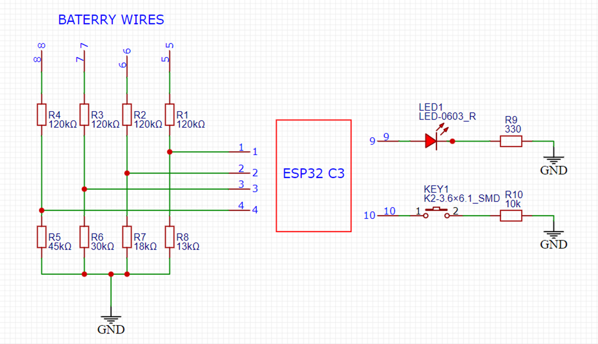
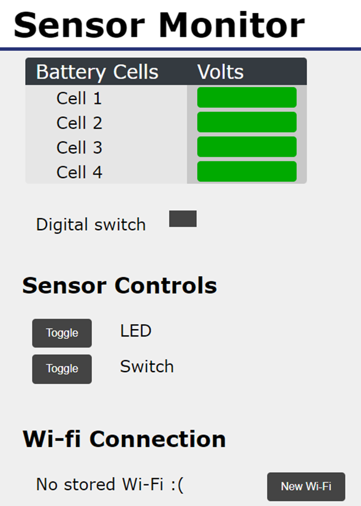
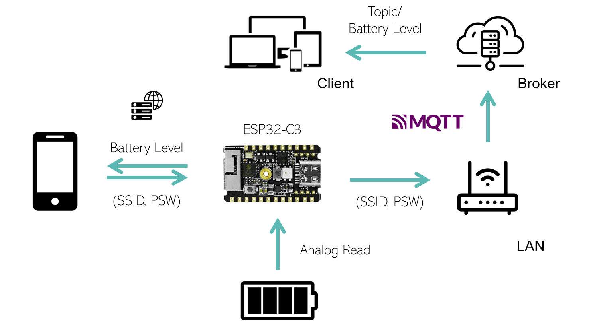

# Smart Battery Web Server

This project implements a web server for a smart battery system using the ESP32-C3 microcontroller. The primary objective is to send the voltage levels of a 4-cell battery to a dedicated web server for remote monitoring. This technology can help enhance battery health management and allow better control of spare units for more accurate replacements when necessary.

## Hardware Requirements

- **ESP32-C3**: The microcontroller used in this project.
- **Resistors:**
  - 4x 120 kΩ
  - 1x 45 kΩ
  - 1x 30 kΩ
  - 1x 18 kΩ
  - 1x 13 kΩ
  - 1x 330 Ω
- **LED**: 1x (used for visual indication)
- **Pushbutton**: 1x (connected with a 10 kΩ resistor)

### Circuit Diagram

Below you can see the electric schematic of the circuit with the ESP32-C3 and the other components:

  <!-- Replace with the actual path to your schematic image -->

## Software Requirements

### Libraries

This project requires the following libraries:

1. **Standard Libraries:**
   - `<WiFi.h>`: This library is used for Wi-Fi connectivity. It is included by default in the ESP32 core libraries.
   - `<WebServer.h>`: This library is used to create the web server. It is also a standard library included in the ESP32 core libraries.

2. **External Libraries (Require Installation):**
   - `<WiFiManager.h>`: Used for managing Wi-Fi connections easily. [WiFiManager GitHub Repository](https://github.com/tzapu/WiFiManager).
   - `<PubSubClient.h>`: A library for MQTT communication. Can be installed via the Arduino Library Manager.
   - `<EEPROM.h>`: Provides support for reading and writing to the EEPROM. Can be installed via the Arduino Library Manager.
   - `<esp32-hal-timer.h>`: Used for managing hardware timers on the ESP32. Can be installed via the Arduino Library Manager.

3. **Custom Files:**
   - `"MyWebPage.h"`: Contains the HTML, CSS, and JavaScript code for the web page interface.
   - `"MyLibrary.h"`: An auxiliary library with specific classes needed for this project.

### Main Components

- **ESP_WebPage.ino**: This file contains the core logic for reading the voltage levels from the battery cells and converting these values to displayable formats. It also handles the interaction with the web server and updates the displayed values in real-time.
  
- **MyWebPage.h**: This file contains the code for the web page that is served by the ESP32. It includes HTML for the structure, CSS for styling, and JavaScript for interactivity.

## Project Overview

The system reads the voltage levels from each of the 4 battery cells and sends this data to a web server hosted on the ESP32-C3. The web interface allows remote monitoring of the battery status, enabling better management of battery health and replacement schedules.

## Visualization

Below is a preview of the web server interface:

  <!-- Replace with the actual path to your image -->

## Installation and Setup

1. **Clone this repository** to your local machine.
2. **Install the necessary libraries** using the Arduino Library Manager or by downloading them directly from the links provided above.
3. **Open `ESP_WebPage.ino`** in the Arduino IDE.
4. **Upload the code** to your ESP32-C3 board.
5. **Connect to the web server** by entering the IP address of the ESP32-C3 in your web browser.
   
## System Architecture

The following diagram illustrates the connection procedure and the relationships between the key components of the web server, including the ESP32, MQTT protocol, and the remote server:

  <!-- Adjust the file path -->
